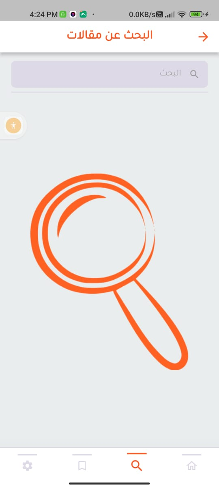

# news App
News is the news application that shows the latest news in Egypt and United States for many categories such as business, health, sports and etc....

</img>
</img>
</img>
</img>
</img>
</img>
✨ Plugins and concepts:

  . 
 This project is built using MVVM architecture pattern with provider for state management
.
   . Singleton design pattern to use database helper concept.
   . Sqflite plugin for saving articles in local memory.
   . Functional programming concept using dartz plugin for handling server errors and exceptions.
       . Remote data from (https://newsapi.org/) api source.

✨ App Features :

    Splash screen.
    Support Arabic and English languages.
    Search bar for searching about any news.
    Possibility to save favorite articles.
    Dark mode and Light mode.
