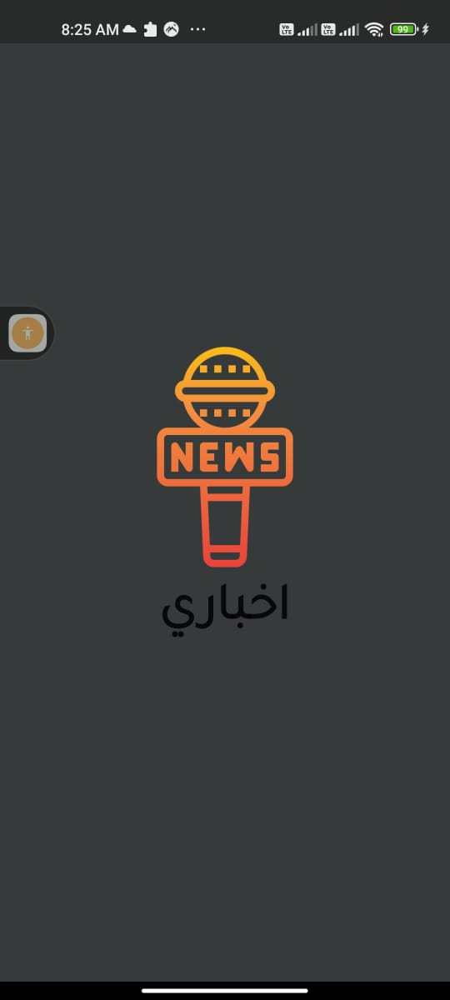

# news App
News is the news application that shows the latest news in Egypt and United States for many categories such as business, health, sports and etc....

</img>
</img>
</img>
</img>
</img>
</img>

✨ Plugins and concepts

   
 This project is built using MVVM architecture pattern with provider for state management

   
 Singleton design pattern to use database helper concept 

    
 Sqflite plugin for saving articles in local memory 

    
Functional programming concept using dartz plugin for handling server errors and exceptions 

    
 Remote data from (https://newsapi.org/) api source

✨ App Features :

    Splash screen.
    Support Arabic and English languages.
    Search bar for searching about any news.
    Possibility to save favorite articles.
    Dark mode and Light mode.
